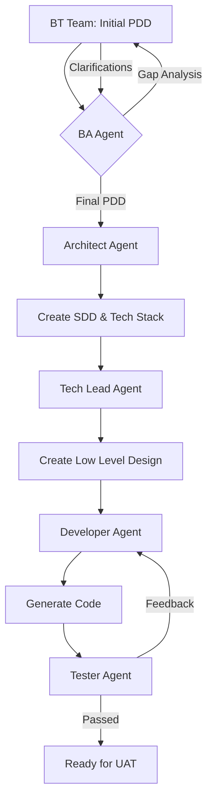
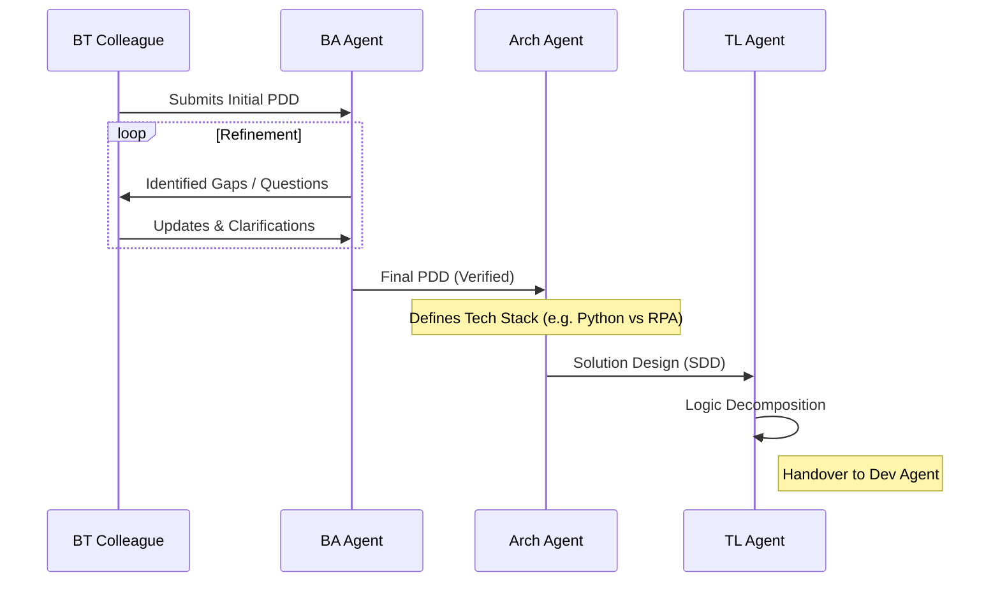

I need a multi page web solution design which i would use to create the full solution. Also assume that you are working in McKinsey and you should follow the design principles which McKinsey would follow. The theme should be light theme (and not Dark theme)

This document outlines a modernized **Agentic Automation Development Lifecycle (A-ADLC)**. In this framework, traditional human roles are replaced by specialized AI Agents capable of reasoning, document generation, and technical validation, while maintaining a crucial interface with the Business Transformation (BT) team.

---

# 🤖 Agentic Automation Development Lifecycle (A-ADLC)

## Table of Contents

1. [Executive Summary](#1-executive-summary)

2. [Agent Roles & Responsibilities](#2-agent-roles--responsibilities)

3. [The Agentic Process Flow](#3-the-agentic-process-flow)

4. [Detailed Stage Breakdown](#4-detailed-stage-breakdown)

5. [Visual Flow Diagrams](#5-visual-flow-diagrams)

6. [Governance & Human-in-the-Loop](#6-governance--human-in-the-loop)

---

## 1. Executive Summary

The A-ADLC transitions automation from a human-heavy delivery model to an **AI-Orchestrated** model. By utilizing specialized LLM-based agents, we reduce the development lead time by up to 70%, ensure 24/7 productivity, and eliminate manual handoff errors.

---

## 2. Agent Roles & Responsibilities

| Role | Human Equivalent | Primary Responsibility | Key Output |

| :--- | :--- | :--- | :--- |

| **BA Agent** | Business Analyst | Requirements scrubbing, gap analysis, and process optimization. | Final PDD (Process Definition Document) |

| **Arch Agent** | Tech Architect | Infrastructure design, tech stack selection, and scalability planning. | SDD (Solution Design Document) |

| **TL Agent** | Tech Lead | Logic decomposition, pseudocode creation, and dev-task mapping. | LLD (Low-Level Design) |

| **Dev Agent** | Developer | Code generation, modular programming, and self-debugging. | Source Code / Bot Package |

| **QA Agent** | Tester | Automated test case generation, execution, and bug reporting. | Test Summary Report |

---

## 3. The Agentic Process Flow

The process follows a linear progression with a recursive feedback loop at the start:

1.  **Ingestion:** BT Colleague submits an Initial PDD.

2.  **Refinement Loop:** BA Agent identifies logic gaps; BT Colleague clarifies.

3.  **Architectural Blueprint:** Arch Agent selects the stack and defines the system interaction.

4.  **Technical Decomposition:** TL Agent breaks the SDD into "buildable" units.

5.  **Execution:** Dev Agent writes code based on LLD.

6.  **Validation:** QA Agent validates against the PDD and SDD.

---

## 4. Detailed Stage Breakdown

### Phase A: Requirement Hardening (BA Agent)

*   **Input:** Draft PDD from Business Transformation (BT) team.

*   **Action:** The BA Agent performs a "Logical Stress Test." It looks for:

    *   Missing exception paths (What if the system is down?).

    *   Ambiguous business rules (What defines a "high priority" customer?).

    *   Data format inconsistencies.

*   **Feedback Loop:** If gaps are found, the BA Agent generates a **Clarification Log**. Once the BT team responds, the BA Agent produces the **Final PDD**.

### Phase B: Solution Architecture (Arch Agent)

*   **Input:** Final PDD.

*   **Action:** The Arch Agent defines the "How."

    *   **Tech Stack Selection:** Chooses between Python, RPA (UiPath/BluePrism), or Low-Code based on complexity, volume, and cost.

    *   **Component Design:** High-level blocks (API layer, UI automation layer, Database layer).

    *   **Reasoning:** Provides a "Why" document (e.g., "Selecting Python for its superior JSON handling over standard RPA tools").

### Phase C: Technical Handover (TL Agent)

*   **Input:** SDD.

*   **Action:** Converts high-level components into a granular **Low-Level Design (LLD)**.

    *   Defines variable naming conventions.

    *   Maps out exact loops and conditional logic.

    *   Prepares a task list for the Dev Agent.

### Phase D: Build & Test (Dev & QA Agents)

*   **Dev Agent:** Consumes the LLD and generates modular code. It performs "Unit Self-Tests" before passing the code forward.

*   **QA Agent:** Uses the original PDD to create test scripts. It executes these against the Dev Agent's output to ensure the business requirements are met 100%.

---

## 5. Visual Flow Diagrams

### High-Level Lifecycle Flow

### Detailed Handshake: BT to Tech Lead

---

## 6. Governance & Human-in-the-Loop

While Agents perform the heavy lifting, human oversight is maintained at critical junctions:

1.  **BT Approval:** The Business Transformation colleague must sign off on the *Final PDD* generated by the BA Agent.

2.  **Architectural Review:** (Optional) A human architect can review the "Reasoning" document provided by the Arch Agent for high-risk financial processes.

3.  **UAT:** The final User Acceptance Testing is still performed by business users to ensure the "look and feel" meets expectations.

---

### Summary of Benefits

*   **Elimination of Silos:** Agents share the same context window, preventing the "loss in translation" between BA and Dev.

*   **Consistency:** Every LLD and SDD follows the exact same format and rigor.

*   **Traceability:** Every decision (from tech stack to logic) is documented by the agents automatically.