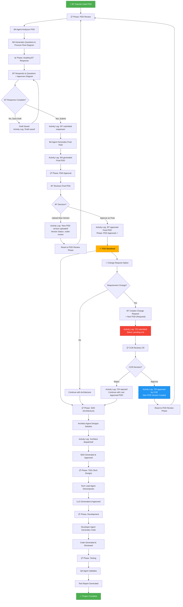

# AASDI Platform: Agentic Solution Development with Human in Lead

A production-ready React + Node.js + MongoDB platform implementing the **Agentic Solution Development with Human in Lead (AASDI)** framework. Orchestrates AI agents (via Claude CLI) through five specialized phases to automate business process automation development.

## 🎯 Overview

The AASDI represents a modernized approach where AI agents handle technical complexity while humans maintain governance through approval gates:

```
User submits PDD → BA Agent hardens requirements → Architecture Agent designs solution 
→ Tech Lead Agent decomposes design → Developer Agent writes code → QA Agent validates
```

Each phase includes human-in-the-loop approval gates, version tracking, change request workflows, and complete audit logs.

---

## 🏗️ Platform Architecture

### Technology Stack
- **Frontend**: React 18 + React Router 6, McKinsey design system CSS
- **Backend**: Express.js + MongoDB for job queuing and project management
- **Agents**: Claude CLI with node.js polling agents for each AASDI phase
- **Database**: MongoDB (local or cloud) for projects, jobs, and audit logs

### File Structure
```
Agent Development/
├── src/                          # React frontend
│   ├── App.jsx                   # Router and navigation
│   ├── index.css                 # Design system + all components
│   ├── api.js                    # API client functions
│   └── pages/
│       ├── Dashboard.jsx         # Project overview & metrics
│       ├── PDDWorkflow.jsx       # New project creation & PDD submission
│       ├── ProjectDetail.jsx     # Project status, phases, activity log
│       ├── GapResponse.jsx       # BT responds to BA questions + approves diagram
│       ├── PDDApproval.jsx       # BT approves final PDD or uploads new version
│       ├── ChangeRequestForm.jsx # BT submits requirement changes to CCB
│       ├── ChangeRequestApproval.jsx  # CCB reviews and approves CRs
│       ├── BAAgent.jsx           # BA Agent dashboard
│       ├── ArchAgent.jsx         # Architect Agent dashboard
│       ├── TLAgent.jsx           # Tech Lead Agent dashboard
│       ├── DevAgent.jsx          # Developer Agent dashboard
│       └── QAAgent.jsx           # QA Agent dashboard
├── server/                       # Express backend
│   ├── index.js                  # Server entry point
│   ├── db.js                     # MongoDB connection
│   ├── routes/
│   │   ├── projects.js           # Project CRUD + PDD version management
│   │   └── jobs.js               # Job queue management + activity logging
│   ├── models/
│   │   └── jobSchema.js          # Job and project data models
│   └── agents/
│       ├── ba-agent.js           # BA Agent (polls, analyzes PDD, generates final PDD)
│       ├── architect-agent.js    # Architect Agent (generates SDD)
│       └── tech-lead-agent.js    # Tech Lead Agent (generates LLD)
├── Prompts/                      # Claude CLI prompt templates
│   ├── ba-agent.md               # BA gap analysis prompt
│   ├── ba-agent-final-pdd.md     # BA final PDD generation prompt
│   ├── architect-agent.md        # Architect design prompt
│   └── tech-lead-agent.md        # Tech Lead decomposition prompt
├── package.json                  # Frontend + backend scripts
├── .env                          # MongoDB URI, port configuration
├── CLAUDE.md                     # Development guide & design system rules
└── README_ASDL.md               # This file
```

---

## 🔄 ASDL Workflow with Complete Decision Logic



---

## 🚀 Quick Start

### Prerequisites
- Node.js 16+ and npm
- MongoDB (local or cloud)
- Claude Code CLI configured

### Installation (5 minutes)

```bash
# 1. Install dependencies
npm install

# 2. Configure environment
cp .env.example .env
# Edit .env with your MongoDB URI

# 3. Start all services (in separate terminals)
# Terminal 1: Frontend
npm start

# Terminal 2: Backend
npm run server

# Terminal 3: BA Agent
npm run ba-agent
```

Open http://localhost:3000 in your browser.

---

## 📖 Key Features

### 1. PDD Version Tracking
- **Initial submission**: v1.0 created when BT submits PDD
- **New versions**: v1.1, v2.0, etc. when BT uploads during approval phase
- **Version history**: Full audit trail visible in Project Detail
- **Status tracking**: under-review → final → superseded

### 2. Process Flow Diagram Approval
- BA Agent generates Mermaid diagram showing business process
- BT reviews and approves or provides feedback
- Feedback incorporated into final PDD generation
- Diagram stored in project for reference

### 3. Activity Logging & Traceability
Every major action is logged with:
- **Timestamp**: When action occurred
- **User/System**: Who/what performed action
- **Action**: Human-readable description
- **Additional context**: Notes, version numbers, reasons

Examples:
```
2026-05-22 10:45:23 | BT Team | BT submitted PDD for BA review (version: v1.0)
2026-05-22 11:30:15 | BA Agent | BA submitted gaps: 5 questions identified
2026-05-22 14:20:08 | BT Team | BT saved draft responses
2026-05-22 16:45:32 | BT Team | BT submitted responses and approved diagram
2026-05-22 17:15:44 | BA Agent | BA generated Final PDD (version: v1.0)
2026-05-22 18:00:00 | BT Team | BT approved BA-generated Final PDD
2026-05-23 09:30:22 | BT Team | BT uploaded new PDD version (v2.0) — BA review restarted
2026-05-23 12:45:10 | CCB | Change Request approved by CCB — BA review will restart
```

### 4. Change Request Workflow
**When to use CRs:**
- After PDD has been baselined (approved)
- When business requirements change
- Requires CCB approval before processing

**CR Process:**
1. BT creates CR with requirement change text + new PDD (both required)
2. CR submitted to Change Control Board (CCB)
3. CCB reviews and decides to approve/reject
4. If approved: New PDD version queued for BA review (restarts from Step 2)
5. If rejected: Last approved PDD continues to be used

### 5. New PDD Version Upload (Pre-Approval)
**When to use:**
- During PDD Approval phase (Step 5 in workflow)
- When BT disagrees with BA-generated version
- Triggered by "Upload New Version" button on PDDApproval page

**Effect:**
- New version number assigned (e.g., v2.0)
- Previous version marked as superseded
- All BA-related phases (pdd-review, awaiting-bt, pdd-approved) reset to pending
- New pdd_review job queued to analyze updated PDD

### 6. Audit Logs & Activity Timeline
- Visible in Project Detail page under "Activity Log" section
- Shows all actions in reverse chronological order (newest first)
- Click through version history to see evolution of PDD
- View all CRs with their approval/rejection status

---

## 🎨 Design System

### McKinsey Editorial Executive
- **Typography**: Fraunces (display), Geist (body), JetBrains Mono (numbers)
- **Color Palette**: Warm off-white bg (#faf9f6), rust-red accent (#b8341a)
- **Components**: KPI grids, tabs, callouts, version cards, activity logs
- **Layout**: 1240px max-width, 880px mobile breakpoint, 1px hairlines

### Theme Toggle
Light mode (default) and dark mode via `data-theme="dark"` attribute. All colors auto-swap via CSS variables.

---

## 🔌 API Endpoints

### Project Management
```
GET    /api/projects              # List all projects
GET    /api/projects/:id          # Get project details
POST   /api/projects              # Create new project
PUT    /api/projects/:id          # Update project
POST   /api/projects/:id/new-pdd-version  # Upload new PDD version
POST   /api/projects/:id/cr-approve       # CCB approves CR
POST   /api/projects/:id/cr-reject        # CCB rejects CR
GET    /api/projects/:id/final-pdd        # Download final PDD
```

### Job Queue
```
POST   /api/jobs                  # Submit job (pdd_review, sdd, tdd, etc.)
GET    /api/jobs/:id              # Get job details
PUT    /api/jobs/:id/claim        # Agent claims job
PUT    /api/jobs/:id/complete     # Mark job completed
PUT    /api/jobs/:id/fail         # Mark job failed
GET    /api/jobs/queue/:stage     # List pending jobs for stage
```

### Job Types/Stages
- `pdd_review` → BA Agent analyzes PDD, generates gaps & diagram
- `pdd_finalize` → BA Agent generates final HTML PDD from BT responses
- `sdd` → Architect Agent designs solution
- `tdd` → Tech Lead Agent decomposes design
- `dev` → Developer Agent generates code
- `qa_sit` / `qa_uat` → QA Agent validates

---

## 💾 Data Model

### Project Document
```javascript
{
  _id: ObjectId,
  name: String,
  description: String,
  status: String,           // "In Progress", "Completed"
  pddVersions: [
    {
      version: Number,      // 1, 2, 3...
      label: String,        // "v1.0", "v2.0"...
      pddFileName: String,
      pddFilePath: String,
      status: String,       // "under-review", "final", "superseded"
      createdAt: Date,
      createdBy: String,
      notes: String
    }
  ],
  baGaps: [                 // Questions BA identified
    { id, question, category, complexity, status }
  ],
  btResponses: {            // BT's answers to gaps
    gapId: { text, submittedAt, isDraft, submittedBy }
  },
  baProcessFlow: String,    // Mermaid diagram
  processFlowApproval: String,  // "approve", "approve-with-comments"
  processFlowComments: String,
  finalPddPath: String,
  changeRequests: [         // CR history
    { id, status, reason, pddFileName, revisionNotes, submittedAt, submittedBy, approvalNotes, reviewedAt, reviewedBy }
  ],
  activityTimeline: [       // Audit log
    { action, user, timestamp, notes, reason }
  ],
  phases: [
    { id, label, icon, status: "pending"|"in-progress"|"completed", progress: 0-100 }
  ],
  createdAt: Date,
  updatedAt: Date
}
```

---

## 📊 Phases & Agents

### Phase 1: PDD Review (BA Agent)
**Input**: Initial PDD document from BT  
**Output**: Identified gaps, Process Flow Diagram  
**Duration**: 1-2 minutes (Claude CLI analysis)  
**Approval Gate**: Manual - BT reviews and answers gaps

### Phase 2: Awaiting BT Response (Human)
**Input**: BA gaps/questions, Process Flow Diagram  
**Output**: BT answers, Process Flow feedback  
**Approval Gate**: BT submits responses + diagram approval

### Phase 3: PDD Finalization (BA Agent)
**Input**: BT responses, feedback on diagram  
**Output**: Final HTML PDD document  
**Duration**: 1-2 minutes (Claude CLI generation)  
**Approval Gate**: BT approves or uploads new version

### Phase 4: Architecture (Architect Agent)
**Input**: Final approved PDD  
**Output**: Solution Design Document (SDD)  
**Duration**: 2-5 minutes  
**Approval Gate**: Architect approval (automated or manual)

### Phase 5: Technical Design (Tech Lead Agent)
**Input**: Approved SDD  
**Output**: Low-Level Design (LLD) with task breakdown  
**Duration**: 2-5 minutes  
**Approval Gate**: Tech Lead approval

### Phase 6: Development (Developer Agent)
**Input**: Approved LLD  
**Output**: Source code with tests  
**Duration**: 5-15 minutes  
**Approval Gate**: Code review approval

### Phase 7: Testing (QA Agent)
**Input**: Code and test cases  
**Output**: Test report, bug log  
**Duration**: 3-10 minutes  
**Approval Gate**: QA sign-off

---

## 🛠️ Development Guide

### Adding a New Page
1. Create `src/pages/NewPage.jsx` with container and header
2. Add route in `src/App.jsx`
3. Add nav link to sidebar

### Modifying Styles
All styles in `src/index.css`. Follow rules:
- ❌ No `border-radius` (square corners only)
- ❌ No `box-shadow` (1px borders only)
- ❌ No hardcoded colors (use CSS variables)
- ✅ Numbers in JetBrains Mono
- ✅ Section labels in ALL CAPS

### Integrating a New Agent
1. Create prompt template in `Prompts/new-agent.md`
2. Create agent polling script in `server/agents/new-agent.js`
3. Add job type to `server/models/jobSchema.js`
4. Create frontend page for agent dashboard
5. Add activity logging in jobs.js

---

## 📝 Environment Variables

Create `.env` in project root:
```env
MONGODB_URI=mongodb://localhost:27017
MONGODB_DB=aadlc
PORT=5000
REACT_APP_API_URL=http://localhost:5000
```

---

## 🧪 Testing the Workflow

1. **Create Project**: Go to `/new-project`, fill form, submit PDD
2. **BA Review**: BA Agent analyzes (watch `npm run ba-agent` terminal)
3. **Respond to Gaps**: Navigate to project, click "Respond to BA Gaps"
4. **Approve Diagram**: Review and approve Process Flow Diagram
5. **View Final PDD**: BA Agent generates, click download
6. **Approve or Upload**: Approve final PDD or upload new version
7. **View Activity Log**: Check "Activity Log" tab to see all actions

---

## 🚨 Troubleshooting

### Port 3000 or 5000 Already in Use
```bash
# Find process using port
netstat -ano | findstr :3000

# Kill it (replace PID)
taskkill /PID <PID> /F
```

### MongoDB Connection Error
```bash
# Ensure MongoDB is running
# Update .env MONGODB_URI if using cloud database
```

### Agent Not Processing Jobs
Check `npm run ba-agent` terminal for errors. Ensure:
- MongoDB is running
- Claude CLI is installed: `which claude`
- Database connection string is correct

---

## 📚 Additional Documentation

- **CLAUDE.md** - Development guide & design system rules
- **DESIGN.md** - Detailed design system specifications
- **SETUP.md** - Installation instructions
- **STARTUP_GUIDE.md** - Service startup methods

---

## 🎯 Next Steps

1. **Run the platform**: `npm start` + `npm run server` + `npm run ba-agent`
2. **Create a test project**: Visit `/new-project`
3. **Submit a sample PDD**: Upload any document
4. **Watch BA Agent**: Check terminal output
5. **Complete the workflow**: Respond to gaps, approve diagram, review final PDD

---

## 📄 License

Proprietary — McKinsey design system inspired, built for AASDI workflow automation.

---

**Platform Version**: 2.0  
**Last Updated**: May 22, 2026  
**Framework**: React 18.2 + Express.js + MongoDB  
**Status**: ✅ Production Ready
