# AASDI Platform — Solution Implementation Guide

A complete guide to understanding and replicating the Agentic Solution Development with Human in Lead (AASDI) platform implementation.

---

## 📋 Solution Overview

The AASDI Platform automates business process automation development through a structured workflow combining AI agents with human governance. This guide explains the complete implementation from project initiation through deployment.

---

## 🔄 ASDL Complete Lifecycle Flow with Decision Logic

```mermaid
graph TD
    Start([📱 Business Requirement]) --> NewProj["🚀 Create New Project"]
    NewProj --> UploadPDD["📤 BT Uploads Initial PDD"]
    UploadPDD --> InitVersion["✨ System Creates v1.0"]
    InitVersion --> PDD_Review["📋 PHASE 1: PDD Review"]
    
    PDD_Review --> BA_Analyze["🤖 BA Agent Analyzes PDD"]
    BA_Analyze --> BA_Questions["📊 Identifies Gaps & Questions"]
    BA_Questions --> BA_Diagram["🎨 Generates Process Flow Diagram"]
    BA_Diagram --> ActLog1["📝 Log: BA submitted gaps"]
    
    ActLog1 --> BT_Response["📋 PHASE 2: Awaiting BT Response"]
    BT_Response --> BT_Read["👤 BT Reviews Questions & Diagram"]
    BT_Read --> BT_Answer["✏️ BT Answers All Questions"]
    BT_Answer --> BT_Approve{"Approve<br/>Diagram?"}
    
    BT_Approve -->|No, Save Draft| SaveDraft["💾 Draft Saved"]
    SaveDraft --> ActLog2["📝 Log: Draft responses saved"]
    ActLog2 --> BT_Answer
    
    BT_Approve -->|Yes, Submit| BT_Submit["✅ BT Submits Responses"]
    BT_Submit --> ActLog3["📝 Log: BT submitted responses + approved diagram"]
    ActLog3 --> BA_Final["🤖 BA Agent Generates Final PDD"]
    BA_Final --> ActLog4["📝 Log: BA generated Final PDD"]
    
    ActLog4 --> PDD_Approval["📋 PHASE 3: PDD Approval"]
    PDD_Approval --> BT_Review["👤 BT Reviews Final PDD"]
    BT_Review --> BT_Decision{Approve or<br/>New Version?}
    
    BT_Decision -->|Approve as Final| Approve["✅ Approve Final PDD"]
    Approve --> ActLog5["📝 Log: BT approved Final PDD"]
    ActLog5 --> Baseline["🎯 PDD Baselined (v1.0)"]
    
    BT_Decision -->|Upload New Version| NewVer["📤 Upload New PDD"]
    NewVer --> NewVersion["✨ System Creates v2.0"]
    NewVersion --> Supersede["⚠️ v1.0 marked as superseded"]
    Supersede --> ActLog6["📝 Log: New version uploaded"]
    ActLog6 --> Reset1["🔄 Reset to PDD Review"]
    Reset1 --> BA_Analyze
    
    Baseline --> PostBaseline{After PDD<br/>Baselined,<br/>Requirement<br/>Change?}
    PostBaseline -->|No | SDD_Phase["📋 PHASE 4: SDD (Architecture)"]
    PostBaseline -->|Yes | CreateCR["📝 BT Creates Change Request"]
    
    CreateCR --> CR_Required["✅ New PDD Required"]
    CR_Required --> CR_Submit["📤 BT Uploads Updated PDD + Reason"]
    CR_Submit --> ActLog7["📝 Log: CR submitted - pending CCB"]
    ActLog7 --> CR_Pending["⏳ Status: pending-ccb"]
    CR_Pending --> CCB_Review["👥 CCB Reviews Change Request"]
    CCB_Review --> CCB_Decision{CCB<br/>Approves?}
    
    CCB_Decision -->|Approve| CR_Approve["✅ CR Approved"]
    CR_Approve --> ActLog8["📝 Log: CR approved by CCB"]
    ActLog8 --> NewCRVersion["✨ Create New PDD Version"]
    NewCRVersion --> Reset2["🔄 Reset to PDD Review"]
    Reset2 --> BA_Analyze
    
    CCB_Decision -->|Reject| CR_Reject["❌ CR Rejected"]
    CR_Reject --> ActLog9["📝 Log: CR rejected - continue with approved PDD"]
    ActLog9 --> SDD_Phase
    
    SDD_Phase --> Arch_Agent["🤖 Architect Agent Designs Solution"]
    Arch_Agent --> SDD_Output["📄 Solution Design Document (SDD)"]
    SDD_Output --> Arch_Approve["✅ SDD Approved"]
    
    Arch_Approve --> TDD_Phase["📋 PHASE 5: TDD (Tech Design)"]
    TDD_Phase --> TL_Agent["🤖 Tech Lead Agent Decomposes Design"]
    TL_Agent --> LLD_Output["📄 Low-Level Design (LLD)"]
    LLD_Output --> TL_Approve["✅ LLD Approved"]
    
    TL_Approve --> Dev_Phase["📋 PHASE 6: Development"]
    Dev_Phase --> Dev_Agent["🤖 Developer Agent Generates Code"]
    Dev_Agent --> Code_Output["📄 Source Code + Tests"]
    Code_Output --> Dev_Approve["✅ Code Approved"]
    
    Dev_Approve --> QA_Phase["📋 PHASE 7: Testing (QA)"]
    QA_Phase --> QA_Agent["🤖 QA Agent Validates Solution"]
    QA_Agent --> Test_Output["📄 Test Report + Bug Log"]
    Test_Output --> QA_Approve["✅ QA Sign-Off"]
    
    QA_Approve --> Complete["✅ PROJECT COMPLETE"]
    Complete --> End([🎉 Solution Delivered])
    
    style Start fill:#4CAF50,stroke:#2E7D32,color:#fff
    style End fill:#4CAF50,stroke:#2E7D32,color:#fff
    style Baseline fill:#FFB300,stroke:#F57F17,color:#000
    style Complete fill:#4CAF50,stroke:#2E7D32,color:#fff
    style Reset1 fill:#2196F3,stroke:#1565C0,color:#fff
    style Reset2 fill:#2196F3,stroke:#1565C0,color:#fff
    style CR_Pending fill:#F44336,stroke:#C62828,color:#fff
    style ActLog1 fill:#E8E8E8,stroke:#666,color:#000
    style ActLog2 fill:#E8E8E8,stroke:#666,color:#000
    style ActLog3 fill:#E8E8E8,stroke:#666,color:#000
    style ActLog4 fill:#E8E8E8,stroke:#666,color:#000
    style ActLog5 fill:#E8E8E8,stroke:#666,color:#000
    style ActLog6 fill:#E8E8E8,stroke:#666,color:#000
    style ActLog7 fill:#E8E8E8,stroke:#666,color:#000
    style ActLog8 fill:#E8E8E8,stroke:#666,color:#000
    style ActLog9 fill:#E8E8E8,stroke:#666,color:#000
```



---

## 🎯 Key Decision Points Explained

### 1. **Draft vs Submit (Phase 2)**
- **Save Draft**: BT can save incomplete answers and return later
- **Submit**: All questions must be answered and diagram approved
- **Outcome**: Triggers BA Agent to generate Final PDD

### 2. **Approve vs Upload (Phase 3)**
- **Approve**: Accept BA-generated Final PDD, proceed to Architecture
- **Upload New Version**: Reject BA version, upload own PDD, restart BA review
- **Use Case**: If BA's interpretation doesn't match requirements

### 3. **Post-Baseline Decision**
- **No Change**: Proceed directly to Architecture (SDD) phase
- **Change Needed**: Create Change Request (only option after baseline)
- **Why**: Change Requests go through CCB governance for control

### 4. **CCB Review Decision**
- **Approve**: New PDD version created and queued for BA review (starts again from gap analysis)
- **Reject**: Continue with last approved PDD, proceed to Architecture
- **Why**: Allows organization to reject risky or unnecessary changes

---

## 🏗️ Implementation Architecture

### Frontend Components (React)

```
Dashboard (/)
├─ Overview metrics
├─ Active projects table
└─ Process explanation

ProjectDetail (/project/:id)
├─ Project info + metrics
├─ Phase timeline
├─ PDD versions list
├─ Change request history
└─ Activity log (audit trail)

PDDWorkflow (/new-project)
├─ Step 1: Project info + PDD upload
├─ Step 2: BA analysis waiting
├─ Step 3: Gap response submission
└─ Step 4: Final approval

GapResponse (/gap-response/:projectId)
├─ BA questions display
├─ Process flow diagram (Mermaid)
├─ BT response textarea (per question)
├─ Diagram approval/comments
└─ Submit/Save Draft buttons

PDDApproval (/pdd-approval/:projectId)
├─ PDD version history
├─ BA-generated final PDD preview
├─ New version upload option (if not approved)
├─ Submit CR button (if approved)
└─ Final approval confirmation

ChangeRequestForm (/change-request/:projectId)
├─ Reason selection
├─ Change notes textarea
├─ New PDD file upload (required)
└─ Submit for CCB review

ChangeRequestApproval (/cr-approval/:projectId)
├─ CR details display
├─ CCB approval/rejection options
└─ Notes textarea
```

### Backend Components (Express + MongoDB)

```
Routes
├─ /api/projects (CRUD + version management)
│  ├─ POST /new-pdd-version (new version upload)
│  ├─ POST /cr-approve (CCB approval)
│  └─ POST /cr-reject (CCB rejection)
├─ /api/jobs (job queue)
│  ├─ POST / (submit job)
│  ├─ PUT /:id/claim (agent claims)
│  ├─ PUT /:id/complete (mark done)
│  └─ GET /queue/:stage (list pending)
└─ Activity logging (on every state change)

Agents (Node.js polling)
├─ ba-agent.js
│  ├─ Polls for pdd_review jobs
│  ├─ Analyzes PDD via Claude CLI
│  ├─ Extracts gaps + process flow
│  ├─ Polls for pdd_finalize jobs
│  ├─ Generates final HTML PDD
│  └─ Logs activity: "BA agent generated Final PDD"
│
├─ architect-agent.js
│  ├─ Polls for sdd jobs
│  ├─ Designs solution via Claude CLI
│  ├─ Generates SDD
│  └─ Logs activity: "Architect agent completed SDD"
│
└─ tech-lead-agent.js
   ├─ Polls for tdd jobs
   ├─ Decomposes design via Claude CLI
   ├─ Generates LLD + tasks
   └─ Logs activity: "Tech Lead agent completed LLD"
```

---

## 📝 Activity Logging System

Every major action is recorded for complete traceability:

```javascript
{
  action: String,        // What happened (e.g., "BT submitted responses")
  user: String,          // Who did it (e.g., "BT Team", "BA Agent", "CCB")
  timestamp: DateTime,   // When it happened
  notes: String,         // Optional: additional context
  reason: String,        // Optional: why (for CRs)
}
```

### Logged Actions
```
BT submitted PDD for BA review (version: v1.0)
BA Agent identified gaps: 5 questions
BT saved draft responses
BT submitted responses and approved Process Flow Diagram
BA Agent generated Final PDD (version: v1.0)
BT approved BA-generated Final PDD
BT uploaded new PDD version (v2.0) — BA review restarted
BT submitted Change Request (pending CCB approval)
CCB approved Change Request — BA review will restart
CCB rejected Change Request — last approved PDD will be used
Architect Agent dispatched for Solution Design
```

---

## 🔐 Data Integrity & Governance

### Version Control
- Each PDD version is immutable (once created, never modified)
- Version status tracks progression: under-review → final → superseded
- Original files stored in `aadlc-pdds` temp directory
- Full path recorded for audit purposes

### Approval Gates
- **PDD Approval**: BT confirms final version before architecture
- **CCB Review**: Change Control Board approves requirement changes
- **Phase Transitions**: Each phase must be completed before next can start

### Change Requests
- Only allowed after PDD is baselined (approved)
- Requires new PDD file + explanation
- CCB has final say on acceptance
- Rejected CRs don't block project (use last approved version)

---

## 🚀 Deployment Checklist

### Before Going Live
- [ ] MongoDB connection tested
- [ ] Claude CLI configured and `claude` command working
- [ ] Environment variables set (.env file)
- [ ] All three services start without errors
- [ ] Frontend accessible at http://localhost:3000
- [ ] Backend API responding at http://localhost:5000
- [ ] BA Agent polls and processes jobs

### Production Setup
- [ ] Use cloud MongoDB (MongoDB Atlas) instead of local
- [ ] Set up proper authentication for API
- [ ] Configure HTTPS (SSL certificates)
- [ ] Set up monitoring and alerting
- [ ] Implement backup strategy for database
- [ ] Test failover and recovery procedures
- [ ] Document API rate limits
- [ ] Set up audit log retention policy

---

## 🔧 Customization Guide

### Add a New Phase/Agent
1. Define phase in project schema: `{ id, label, status, progress }`
2. Create agent polling script in `server/agents/`
3. Add job type to `server/models/jobSchema.js`
4. Create frontend dashboard page for agent
5. Add activity logging on phase transitions
6. Document in this guide

### Modify Approval Flow
1. Update phase definitions in `server/routes/projects.js`
2. Add/modify approval endpoints in `server/routes/jobs.js`
3. Update gating logic in frontend components
4. Ensure activity logs capture new decision points
5. Update this diagram

### Add New Decision Point
1. Identify where decision happens (which page/API)
2. Define decision options and outcomes
3. Implement option handlers
4. Add activity logs for each outcome
5. Update this workflow diagram

---

## 📊 System Performance

### Typical Processing Times
| Phase | Duration | Notes |
|-------|----------|-------|
| PDD Review | 1-2 min | Claude CLI gap analysis |
| BT Response | 5-10 min | Manual human review |
| Final PDD Generation | 1-2 min | Claude CLI generation |
| Architecture Design | 2-5 min | Claude CLI design |
| Technical Design | 2-5 min | Claude CLI decomposition |
| Code Generation | 5-15 min | Claude CLI coding |
| QA Testing | 3-10 min | Claude CLI test generation |

### Scalability Considerations
- Job queue can handle 100+ pending jobs
- MongoDB handles 1M+ activity log entries
- Frontend caches project data (refresh on change)
- Agent polling: stagger requests to avoid thundering herd
- Consider adding Redis for job queue in production

---

## 🆘 Troubleshooting Common Issues

### BA Agent Not Processing
```bash
# Check BA Agent terminal for errors
# Verify job was created: GET /api/jobs/queue/pdd_review
# Check MongoDB connection: mongosh
# Restart BA Agent: npm run ba-agent
```

### Activity Logs Not Appearing
```bash
# Verify timestamps are correctly recorded
# Check MongoDB: db.projects.findOne({_id: ObjectId(...)}).activityTimeline
# Ensure log writes aren't silently failing
```

### CR Submission Fails
```bash
# Verify PDD file is actually provided
# Check file size (shouldn't exceed 10MB)
# Verify mongoDB can accept CR document
# Check server logs for file saving errors
```

---

## 📚 Related Documentation

- **README.md** - Main platform documentation
- **CLAUDE.md** - Development guide & design rules
- **DESIGN.md** - Design system specifications
- **STARTUP_GUIDE.md** - How to start services

---

## 🎓 Learning Path

1. **Start Here**: Read README.md for overview
2. **Understand Flow**: Study this diagram
3. **Set Up**: Follow STARTUP_GUIDE.md
4. **Build**: Read CLAUDE.md development guide
5. **Customize**: Use customization guide above
6. **Deploy**: Follow deployment checklist

---

## 📞 Support

For questions or issues:
1. Check console output for error messages
2. Review MongoDB logs
3. Check Claude CLI status: `claude --version`
4. Verify network connectivity between services
5. Restart all services from clean state

---

**Solution Version**: 2.0  
**Last Updated**: May 22, 2026  
**Status**: ✅ Production Ready  
**Mermaid Diagram Version**: 1.2 (Complete with all decision logic)
